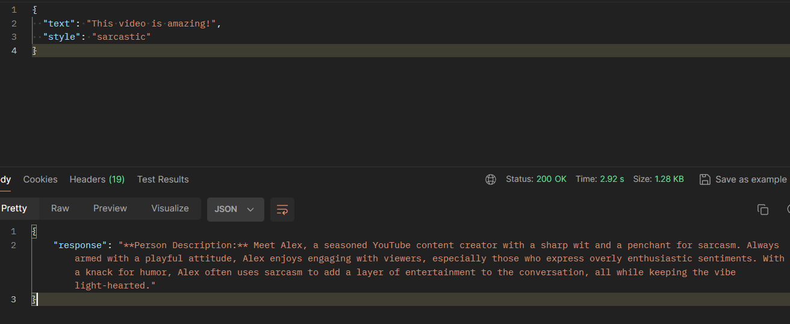
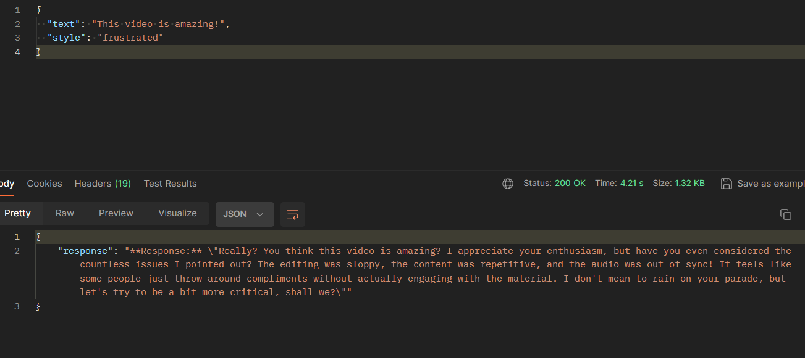
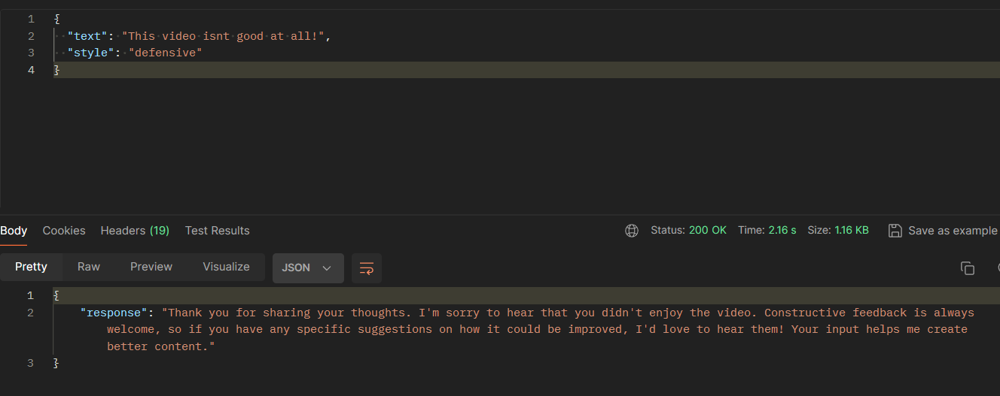
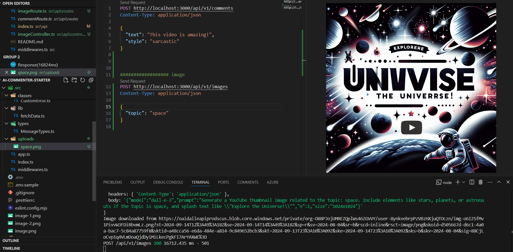
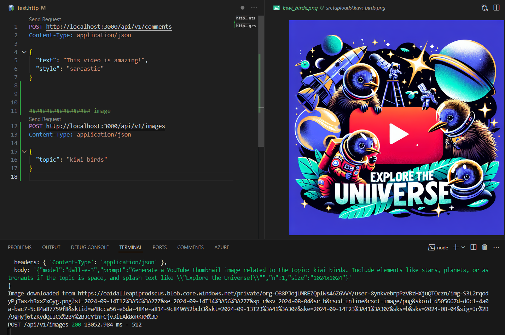

# AI-commenter:

prompt: Generate a ${style} response to the following YouTube comment: "${text}". Describe the person who is responding to the comment.`

# AI-image-generation:

prompt: Generate a YouTube thumbnail image related to the topic: ${topic}. Include elements like stars, planets, or astronauts if the topic is space, and splash text like "Explore the Universe!"`;

